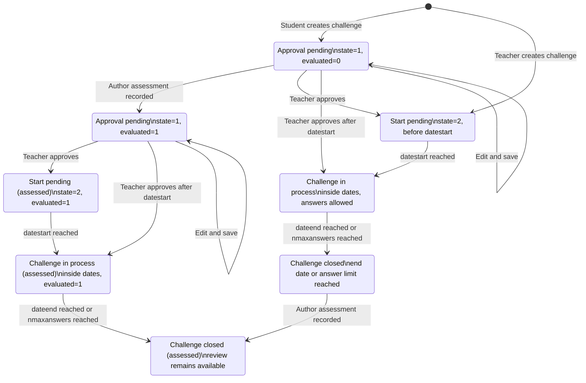
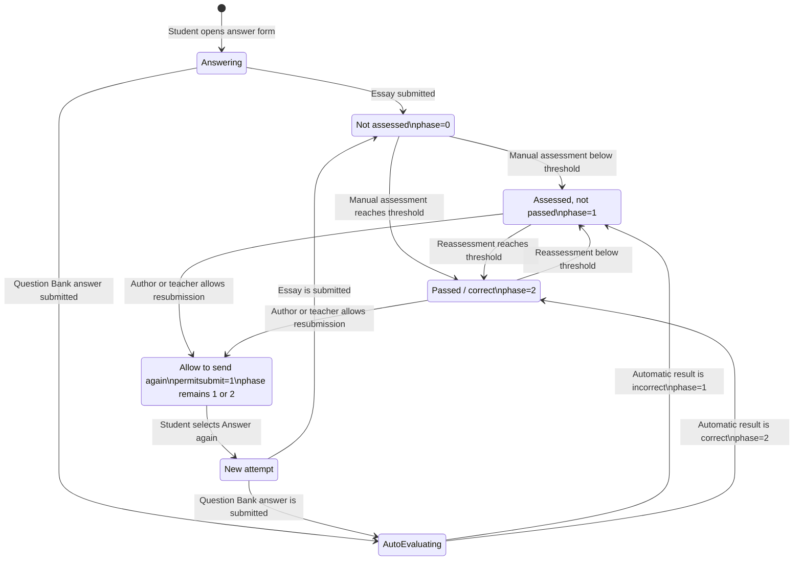
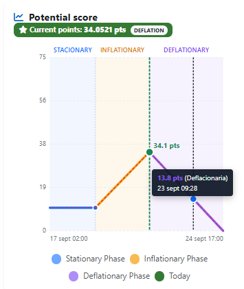
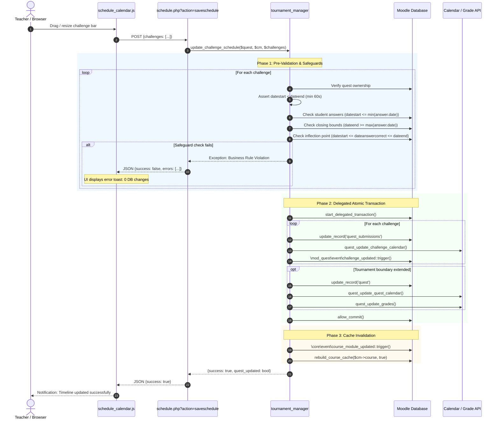

# QUESTOURnament for Moodle (`mod_quest`)

**QUESTOURnament: Intellectual Challenges, Peer Assessment, and Gamified Tournament Activity for Moodle**

QUESTOURnament (`mod_quest`) is an advanced educational gamification activity module for Moodle 4.x and 5.x. It enables instructors and students to launch, solve, and peer-assess time-constrained intellectual challenges in competitive or collaborative learning tournaments (both individual and group-based), governed by a real-time dynamic scoring model (stationary, inflationary, and deflationary curves).

- **Author:** Juan Pablo de Castro <[juan.pablo.de.castro@gmail.com](mailto:juan.pablo.de.castro@gmail.com)>
- **Organization:** EDUVALab, University of Valladolid
- **License:** GNU General Public License v3 or later (GPLv3+)
- **Compatibility:** Moodle 4.05 to Moodle 5.02+ (PHP 8.1+, Boost, Moove, and modern Bootstrap 5 themes)

---

## Table of Contents
1. [Overview and Pedagogical Rationale](#1-overview-and-pedagogical-rationale)
2. [Key Features](#2-key-features)
3. [User Manual & Operations](#3-user-manual--operations)
   - [Challenge Lifecycle & States](#challenge-lifecycle--states)
   - [Answer Lifecycle & States](#answer-lifecycle--states)
   - [Dynamic Scoring Model (Stationary, Inflationary, Deflationary)](#dynamic-scoring-model-stationary-inflationary-deflationary)
   - [Authoring and Peer Assessment Workflow](#authoring-and-peer-assessment-workflow)
   - [Interactive Challenge Scheduler (GANTT Timeline)](#interactive-challenge-scheduler-gantt-timeline)
   - [Question Bank Integration & Automated Grading](#question-bank-integration--automated-grading)
   - [Leaderboards & Official Tournament Rankings](#leaderboards--official-tournament-rankings)
4. [Configuration & Tournament Settings](#4-configuration--tournament-settings)
5. [Permissions, Capabilities & Custom Role Profiles](#5-permissions-capabilities--custom-role-profiles)
   - [Capabilities Reference Matrix](#capabilities-reference-matrix)
   - [Tailored Role Profiles & Recipes](#tailored-role-profiles--recipes)
   - [Configuring Roles and Overrides in Moodle](#configuring-roles-and-overrides-in-moodle)
6. [Installation, Upgrade & Development](#6-installation-upgrade--development)
7. [Changelog & Version History](#7-changelog--version-history)
8. [Authors & Credits](#8-authors--credits)
9. [ANNEX: Software design notes](#annex-software-design-notes)
   - [Service-Oriented Domain Layer (`classes/service/`)](#service-oriented-domain-layer-classesservice)
   - [Safe Date Modification Engine & Safeguards (`tournament_manager`)](#safe-date-modification-engine--safeguards-tournament_manager)
   - [Official Tournament Ranking & Reordering Engine (`leaderboard_service`)](#official-tournament-ranking--reordering-engine-leaderboard_service)
   - [Interactive Vector Scoring Curves (`scoring_service` & AMD)](#interactive-vector-scoring-curves-scoring_service--amd)
   - [Modern Templating Layer (`classes/output/` & Mustache)](#modern-templating-layer-classesoutput--mustache)
   - [Project Directory Structure](#project-directory-structure)

---

## 1. Overview and Pedagogical Rationale

In contemporary higher education and professional training, passive learning models often struggle to maintain student engagement over extended learning periods. **QUESTOURnament** addresses this by transforming the virtual classroom into an active intellectual tournament where:

1. **Students as Creators**: Learners do not simply answer questions; they can propose original intellectual challenges, formulating problem statements, sample solutions, and evaluation rubrics.
2. **Dynamic Incentives**: Points awarded for solving a challenge are not static. The scoring mechanism fluctuates based on difficulty and time, rewarding students who tackle tough unanswered challenges or solve problems first.
3. **Peer Assessment**: Students assess peer solutions according to teacher-defined multi-criteria rubrics, developing evaluative judgment and critical thinking skills.
4. **Cooperative-Competitive Balance**: Tournaments can be run individually, strictly in teams, or with blended scoring where team success augments individual performance.

---

## 2. Key Features

- **Modern Responsive Interface (Boost / Bootstrap 5)**: Completely modernized UI eliminating legacy HTML tables, offering interactive card views, list views, progress badges, and live countdown timers.
- **Interactive Vector Scoring Chart (AMD)**: Real-time SVG chart visualizes stationary, inflationary, and deflationary phases, inflection points (first correct answer), and active time markers.
- **Interactive Challenge GANTT Scheduler (`schedule.php`)**:
  - Direct pointer-and-touch manipulation of challenge timelines.
  - Multi-tier calendar header (Years, Months, Days, Hours) and automatic weekend shading.
  - Bidirectional bar resizing with overlap handling for narrow or short-duration challenges.
  - Atomic validation with auto-expansion of tournament boundaries and synchronization of Moodle calendar events (`{event}`).
- **Question Bank Integration (`mod_qbank` / Core Question API)**:
  - Integration modal to import questions from the course Question Bank directly into challenges.
  - Automated question grading for supported question types (multiple choice, true/false, short answer).
  - Ability to export teacher-approved student challenges back into the course Question Bank.
- **Official Tournament Leaderboards (`viewclasification.php`)**:
  - Canonical ranking computation (`points DESC, nanswers DESC, userid/teamid ASC`) with tie-breaking rules.
  - Intrinsic rank reordering: sorting by name, answers, or points preserves the participant's official rank and badge.
  - Exclusive vector SVG drawings for medal winners (🥇 Gold, 🥈 Silver, 🥉 Bronze) with ribbon drape and metallic radial gradients.
  - Direct numeric rank display starting from position 4 onwards (`4`, `5`, `6`...).
- **Atomic Persistence & Integrity Safeguards**: Full transaction safety preventing date collisions, orphan calendar events, or gradebook desynchronization.

---

## 3. User Manual & Operations

### Challenge Lifecycle & States

Challenge status is derived from several fields in `quest_submissions`, rather
than from one single state column:

| Field / condition | Meaning |
| :--- | :--- |
| `state = 1` | The challenge is awaiting teacher approval. It is normally created by a student. |
| `state = 2` | The challenge has been approved and can follow its schedule. |
| `evaluated = 0` | The author assessment of the challenge has not been completed. |
| `evaluated = 1` | The author assessment has been recorded. For teachers and authors this adds the corresponding “assessed” phase label. |
| `datestart > now` | Start pending. |
| `datestart <= now < dateend` and `nanswerscorrect < nmaxanswers` | In process: answers can be submitted. |
| `now >= dateend` or `nanswerscorrect >= nmaxanswers` | Closed: new answers are no longer accepted, but assessment and review can continue. |

The user-facing phase is the combination of these values. In particular,
“Approval pending”, “Start pending”, “Challenge in process”, and “Challenge
closed” may each have an assessed variant when `evaluated = 1`.



The `Closed` states are scheduling states, not deletion states. A closed
challenge and its answers remain available according to the activity's
visibility and author-anonymity settings.

### Answer Lifecycle & States

Answers use two related concepts:

| Field | Values | Meaning |
| :--- | :--- | :--- |
| `phase` | `0` — Not assessed | The answer has not received a final assessment. This is the initial phase for essays and other manually graded answers. |
| `phase` | `1` — Assessed | The answer has been evaluated but did not reach the passing threshold. An automatically graded incorrect answer is still assessed and therefore uses phase `1`. |
| `phase` | `2` — Passed / correct | The answer reached the passing threshold. An automatically graded correct answer is stored directly in phase `2`. |
| `state` | `0`, `1`, `2` | Editing metadata: unedited, edited, or modified after an assessment. It does not replace `phase`. |
| `permitsubmit` | `0` / `1` | Whether the author or teacher has allowed another submission. This is an additional flag and does not change the answer phase. |

The two answer paths differ only in who performs the first evaluation:

- **Essay or other manually graded question**: submit → phase `0` → author or
  teacher assesses → phase `1` (not passed) or phase `2` (passed).
- **Automatically graded question**: submit → Question Engine evaluates → phase
  `1` when incorrect or phase `2` when correct. A failed automatic answer is
  therefore evaluated, even though it is not correct.



Allowing a resubmission does not delete the old answer or its Question Engine
usage. The new attempt is created when the student answers again, so the old
record remains available in the history.

---

### Dynamic Scoring Model (Stationary, Inflationary, Deflationary)

QUESTOURnament employs a three-phase mathematical scoring curve that automatically balances challenge difficulty and rewards early problem-solving:



The diagram above shows the stationary, inflationary, and deflationary scoring
phases. The inflection point is `dateanswercorrect`, the time at which the
first correct answer is registered for the challenge.

1. **Stationary Phase**:
   - Lasts for a configured duration from the challenge start date.
   - The score remains constant at the baseline proposed score, giving all students time to read and comprehend the challenge.
2. **Inflationary Phase**:
   - If no correct answers are submitted, the reward increases progressively over time up to the maximum score (`maxpoints`).
   - *Rationale*: A challenge that remains unsolved is deemed difficult, so the incentive increases to motivate learners.
3. **Deflationary Phase**:
   - Triggered at the exact moment the **first correct answer** is submitted (`dateanswercorrect`).
   - The reward progressively decreases towards `minpoints` as the deadline approaches.
   - *Rationale*: The pioneer who solves the problem first receives maximum reward; subsequent solvers earn progressively fewer points.

---

### Authoring and Peer Assessment Workflow

1. **Challenge Proposal**:
   - Students click **Propose Challenge**, entering the title, description, attachments, suggested initial points, and rubric assessment elements.
2. **Teacher Review & Approval**:
   - Teachers inspect proposed challenges in the **Pending Approval** queue, editing parameters if necessary and approving them into the tournament schedule.
3. **Answer Submission**:
   - Students view active challenges and submit their textual explanations and file attachments before the deadline.
4. **Multi-Criteria Assessment**:
   - Answers are assessed using teacher-defined criteria (scales or numerical rubrics).
   - Author anonymity options ensure unbiased double-blind grading.
   - Final grades combine points earned as solvers and points earned as authors whose challenges were validated and solved.

---

### Interactive Challenge Scheduler (GANTT Timeline)

Located at `schedule.php?id={cmid}`, the scheduler provides instructors with visual control over all tournament challenges:

- **Direct Timeline Manipulation**:
  - Drag the central body of any challenge bar to shift its schedule forward or backward.
  - Hover over the left or right edges (`col-resize`) to adjust start or end dates individually.
  - Narrow bars (< 24px wide) automatically detect left-half vs right-half pointer clicks to allow resizing in either direction without blockage.
- **Multilevel Time Scale**:
  - Three header tiers adapt dynamically to the timeline span (Years/Months/Days for long tournaments; Months/Days/Hours for short tournaments).
  - Weekends are automatically highlighted based on user locale settings.
- **Tournament Boundary Auto-Expansion**:
  - If a challenge is extended beyond the tournament's overall dates (`quest->datestart` or `quest->dateend`), the system automatically expands the tournament limits and resynchronizes course module calendar events.
- **Safety Safeguards**:
  - Prevents dragging a challenge's start date after existing student answers.
  - Prevents moving closing dates prior to submitted answers or excluding the inflection point (`dateanswercorrect`).

---

### Question Bank Integration & Automated Grading

QUESTOURnament integrates seamlessly with the Moodle Question Bank (`core_question` and `mod_qbank`):

1. **Question Import**:
   - When creating or editing a challenge, teachers can launch the Question Bank modal to select pre-existing questions.
2. **Automated Evaluation**:
   - Multiple Choice, True/False, and Short Answer questions are automatically evaluated upon student submission, immediately triggering the deflationary phase if correct.
3. **Export to Activity Question Bank**:
   - High-quality student-authored challenges can be exported directly into the course Question Bank for reuse in future quizzes or assessments.

---

### Leaderboards & Official Tournament Rankings

Located at `viewclasification.php?id={cmid}`:

- **Intrinsic Official Rank**:
  - Every participant and team has an official tournament rank based on competitive achievement:
    $$\text{Ranking Order: } \text{points DESC} \longrightarrow \text{nanswers DESC} \longrightarrow \text{userid/teamid ASC}$$
  - The Rank column travels with the participant when reordering by any column (name, answers, author points).
- **Medal Drawings (1st, 2nd, and 3rd Place)**:
  - Positions 1, 2, and 3 display vector SVG drawings of medals with ribbon drape and metallic radial gradients:
    - **1st Place**: Gold Medal (🥇 `quest-medal-gold`)
    - **2nd Place**: Silver Medal (🥈 `quest-medal-silver`)
    - **3rd Place**: Bronze Medal (🥉 `quest-medal-bronze`)
- **Numbered Positions from 4 Onwards**:
  - Participants ranked 4th and below are numbered cleanly as `4`, `5`, `6`... (`.quest-rank-number`), without `#` prefixes and without medals.
- **Team vs Individual Views**:
  - Full support for individual standings, team standings, and combined scoring based on the configured team percentage (`teamporcent`).

---

## 4. Configuration & Tournament Settings

When adding or configuring a QUESTOURnament activity in a course:

1. **Tournament Timing**:
   - `datestart` / `dateend`: Overall tournament active window.
2. **Team Configuration**:
   - `allowteams`: Enable team-based tournament play.
   - `teamporcent`: Percentage of team points factored into individual student standings (0% to 100%).
3. **Scoring Parameters**:
   - `initialpoints`: Baseline score for stationary phase.
   - `maxpoints`: Ceiling for inflationary phase.
   - `minpoints`: Floor for deflationary phase.
   - `stationarytime`: Duration in hours/days before inflation starts.
4. **Authoring & Anonymity**:
   - `studentcanpropose`: Allow students to author challenges.
   - `showauthoringdetails`: Toggle author visibility or preserve double-blind anonymity.
   - `showclasifindividual`: Enable/disable individual classification in team tournaments.

---

## 5. Permissions, Capabilities & Custom Role Profiles

QUESTOURnament includes a comprehensive permission system defined in `db/access.php`. By configuring specific capabilities, administrators and course creators can create fine-grained educational roles to support diverse pedagogical scenarios (e.g., student-authored tournaments, instructor-controlled competitive exams, tutor-moderated challenges, or external audits).

### Capabilities Reference Matrix

The following table summarizes all capabilities provided by `mod_quest`, their context level, risk flags, default archetype assignments, and the specific functionality they unlock:

| Capability | Context Level | Type / Risk | Default Roles | Functionality Unlocked |
| :--- | :--- | :--- | :--- | :--- |
| `mod/quest:addinstance` | `CONTEXT_COURSE` | Write / `RISK_XSS` | Teacher, Manager | Add a new QUESTOURnament instance to a course and configure tournament settings. |
| `mod/quest:view` | `CONTEXT_MODULE` | Read | Guest, Student, Teacher, Non-editing Teacher, Manager | Access and view the tournament page (`view.php`), countdowns, challenge listings, and public standings. |
| `mod/quest:attempt` | `CONTEXT_MODULE` | Write / `RISK_SPAM` | Student | Submit answers and solutions to active challenges (`answer.php`). Participate as a contestant/solver. |
| `mod/quest:addchallenge` | `CONTEXT_MODULE` | Write / `RISK_SPAM` | Student, Teacher, Non-editing Teacher, Manager | Propose and create new intellectual challenges (`challenges.php?action=add`). Define rubrics, initial points, and attachments. |
| `mod/quest:editchallengemine` | `CONTEXT_MODULE` | Write / `RISK_SPAM` | Student, Teacher, Non-editing Teacher, Manager | Edit one's own authored challenges while in pending/unapproved state. |
| `mod/quest:deletechallengemine` | `CONTEXT_MODULE` | Write | Student, Teacher, Non-editing Teacher, Manager | Delete one's own authored challenge before teacher approval or before it starts. |
| `mod/quest:editchallengeall` | `CONTEXT_MODULE` | Write | Teacher, Manager | Edit any challenge in the tournament regardless of author (modify text, timing, rubrics). |
| `mod/quest:deletechallengeall` | `CONTEXT_MODULE` | Write | Teacher, Manager | Delete any challenge from the tournament regardless of author. |
| `mod/quest:approvechallenge` | `CONTEXT_MODULE` | Write / `RISK_SPAM` | Teacher, Non-editing Teacher, Manager | Review the approval queue (`challenges.php?action=pendingapproval`), approve or reject student-proposed challenges, and release them into the tournament schedule. |
| `mod/quest:manage` | `CONTEXT_MODULE` | Write | Teacher, Manager | General tournament management: access the interactive GANTT challenge scheduler (`schedule.php`), drag/resize dates, edit tournament settings, and force score recalculations. |
| `mod/quest:preview` | `CONTEXT_MODULE` | Read / `RISK_PERSONAL` | Teacher, Non-editing Teacher, Manager | Preview challenge details, proposed solutions, and teacher rubrics before the official challenge opening date (`datestart`). |
| `mod/quest:grade` | `CONTEXT_MODULE` | Write / `RISK_SPAM` | Teacher, Non-editing Teacher, Manager | Manually assess student answers, evaluate rubrics, provide feedback, and override peer assessment scores (`assess_answers.php`). |
| `mod/quest:approvegrade` | `CONTEXT_MODULE` | Write / `RISK_SPAM` | Teacher, Non-editing Teacher, Manager | Review and officially validate student peer assessments before publishing grades to students. |
| `mod/quest:manageownchallenge` | `CONTEXT_MODULE` | Write / `RISK_SPAM` | Teacher, Non-editing Teacher, Manager | Specialized management of challenges authored under one's own user account. |
| `mod/quest:gradeownchallenge` | `CONTEXT_MODULE` | Write / `RISK_SPAM` | Teacher, Non-editing Teacher, Manager | Grade solutions submitted by other participants to challenges authored by oneself. |
| `mod/quest:viewreports` | `CONTEXT_MODULE` | Read / `RISK_PERSONAL` | Teacher, Non-editing Teacher, Manager | View tournament statistical reports, detailed student log statistics, and historical submission metrics. |
| `mod/quest:downloadlogs` | `CONTEXT_MODULE` | Read | Teacher, Non-editing Teacher, Manager | Download and export raw tournament logs and CSV performance reports (`getLogs.php` and `viewclasification.php?action=export`). |
| `mod/quest:viewotherattemptsowners` | `CONTEXT_MODULE` | Read | Teacher, Non-editing Teacher, Manager | Bypass author and peer anonymity to view the real identity of students behind challenge submissions, peer evaluations, and answers. |
| `mod/quest:deleteattempts` | `CONTEXT_MODULE` | Write / `RISK_DATALOSS` | Teacher, Non-editing Teacher, Manager | Delete invalid student attempts, reset answer submissions, and purge test submissions. |
| `mod/quest:emailconfirmchallenge` | `CONTEXT_MODULE` | Read | Student, Teacher, Non-editing Teacher, Manager | Receive automated email confirmations when submitting a challenge or answer. |
| `mod/quest:emailnotifychallenge` | `CONTEXT_MODULE` | Read | Teacher, Non-editing Teacher, Manager | Receive automated notification alerts when other participants submit new challenges or answers. |
| `mod/quest:ignoretimelimits` | `CONTEXT_MODULE` | Read | *(None by default)* | Educational accommodation allowing designated students or evaluators to submit answers beyond the challenge deadline. |

---

### Tailored Role Profiles & Recipes

Depending on your pedagogical design, you can define custom roles or permission overrides for specific cohorts:

#### 1. Tournament Coordinator / Lead Teacher (`editingteacher`)
- **Profile Goal**: Full architectural, pedagogical, and administrative control over the tournament.
- **Key Capabilities Granted**:
  - All `mod/quest:*` capabilities set to **Allow**.
  - Exclusive access to `mod/quest:manage` (GANTT scheduler), `mod/quest:addinstance`, `mod/quest:editchallengeall`, `mod/quest:deletechallengeall`, and `mod/quest:deleteattempts`.

#### 2. Course Tutor / Teaching Assistant (`teacher` / `non-editing teacher`)
- **Profile Goal**: Support student learning by reviewing student-proposed challenges, grading answers, validating peer rubrics, and resolving student doubts, without the power to delete tournament configurations or alter course module settings.
- **Recommended Configuration**:
  - **Allow**: `mod/quest:view`, `mod/quest:preview`, `mod/quest:approvechallenge`, `mod/quest:grade`, `mod/quest:approvegrade`, `mod/quest:viewreports`, `mod/quest:downloadlogs`, `mod/quest:viewotherattemptsowners`, `mod/quest:emailnotifychallenge`.
  - **Prevent**: `mod/quest:manage` (keeps global GANTT scheduling reserved for lead teachers), `mod/quest:editchallengeall`, `mod/quest:deletechallengeall`, `mod/quest:deleteattempts`.

#### 3. Active Contributor Student (Author & Solver)
- **Profile Goal**: Standard participatory gamified tournament where students act both as challenge authors and as competitive problem solvers.
- **Recommended Configuration**:
  - **Allow**: `mod/quest:view`, `mod/quest:attempt`, `mod/quest:addchallenge`, `mod/quest:editchallengemine`, `mod/quest:deletechallengemine`, `mod/quest:emailconfirmchallenge`.
  - **Prevent**: `mod/quest:approvechallenge`, `mod/quest:editchallengeall`, `mod/quest:manage`, `mod/quest:grade`, `mod/quest:viewreports`.

#### 4. Solver-Only Student (Closed Competitive Tournament)
- **Profile Goal**: Formal examinations, weekly review quizzes, or instructor-driven tournaments where students must solve challenges prepared exclusively by the teaching team, without permission to author new challenges.
- **Recommended Configuration**:
  - **Allow**: `mod/quest:view`, `mod/quest:attempt`, `mod/quest:emailconfirmchallenge`.
  - **Prevent / Prohibit**:
    - `mod/quest:addchallenge` $\longrightarrow$ **Prevent** (removes the "Propose Challenge" button from UI).
    - `mod/quest:editchallengemine` $\longrightarrow$ **Prevent**.
    - `mod/quest:deletechallengemine` $\longrightarrow$ **Prevent**.

#### 5. External Evaluator / Course Auditor (Read-Only Quality Assurance)
- **Profile Goal**: External examiners, curriculum auditors, or researchers who need to inspect student work, rubrics, and grade distributions without participating in the tournament or modifying scores.
- **Recommended Configuration**:
  - **Allow**: `mod/quest:view`, `mod/quest:preview`, `mod/quest:viewreports`, `mod/quest:downloadlogs`, `mod/quest:viewotherattemptsowners`.
  - **Prevent / Prohibit**: `mod/quest:attempt`, `mod/quest:addchallenge`, `mod/quest:grade`, `mod/quest:approvechallenge`, `mod/quest:manage`.

---

### Configuring Roles and Overrides in Moodle

#### Method A: Site-Wide Role Creation (for repeated use across all courses)
1. Navigate to **Site administration > Users > Permissions > Define roles**.
2. Click **Add a new role**, choose an archetype (e.g., *Student* for a *Solver-Only Student*, or *Non-editing teacher* for a *Tutor*), and click **Continue**.
3. Name the role (e.g., `QUESTOURnament Solver-Only`).
4. In the capability filter, search for `mod/quest`.
5. Adjust the permissions according to the recipes above and click **Create this role**.
6. Instructors can now assign this role when enrolling students into the course.

#### Method B: Activity-Level Permission Overrides (for a single tournament)
If you only need to restrict challenge creation for one specific QUESTOURnament without creating a site-wide role:
1. Enter the specific QUESTOURnament activity.
2. In the secondary menu, go to **More > Permissions** (or under activity administration).
3. In the dropdown, filter by `addchallenge`.
4. Locate the **Student** role next to **mod/quest:addchallenge (Add questournament challenge)** and click the delete/prohibit icon ($\times$) to remove student authoring for that specific activity.

---

## 6. Installation, Upgrade & Development

### Prerequisites
- Web server running PHP 8.1 or higher.
- Moodle 4.05 LTS, 4.5 LTS, 5.02, or higher.

### Installation Steps
1. Clone or extract the repository into the Moodle `mod/` directory:
   ```bash
   git clone https://github.com/juacas/moodle-mod_quest.git mod/quest
   # Resulting directory must be: {moodle_root}/mod/quest
   ```
2. Run the Moodle database upgrade via web interface (`/admin/index.php`) or CLI:
   ```bash
   php admin/cli/upgrade.php
   ```
3. Purge Moodle caches:
   ```bash
   php admin/cli/purge_caches.php
   ```

### Frontend Asset Compilation (AMD)
To compile or modify JavaScript modules in `amd/src/`:
```bash
# Using standard Moodle Grunt tooling:
grunt amd

# Or using terser directly:
npx terser amd/src/schedule_calendar.js --comments "/@license|@copyright|@author|@package|@module/" -o amd/build/schedule_calendar.min.js --source-map "url=schedule_calendar.min.js.map"
```

### Automated Testing
Run the PHPUnit test suite for `mod_quest`:
```bash
vendor/bin/phpunit --testsuite mod_quest_testsuite
```

---

## 7. Changelog & Version History

- **v2.2.0 (2026-09-19)**:
  - **Leaderboard Overhaul**: Canonical tournament rank calculation with intrinsic sorting reordering.
  - **Vector Medal Drawings**: Dedicated SVG drawings for Gold (1º), Silver (2º), and Bronze (3º) medalists; direct numeric positioning from 4th onwards.
  - **Scheduler Integrity Safeguards**: Atomic pre-validation for challenge dates, answer dependency verification, inflection point constraints, and automatic tournament boundary expansion.
  - **Permissions & Roles Documentation**: Comprehensive capabilities matrix and tailored role recipes for lead teachers, tutors, author students, solver-only students, and auditors.
  - **Cache & Subsystem Sync**: Multi-environment synchronization across Moodle 4.05 and 5.02+.
- **v2.1.0 (2026-09-18)**:
  - **GANTT Timeline**: Interactive challenge rescheduling (`schedule.php`) with multi-tier header and weekend shading.
  - **Modern Templating**: Introduced Mustache templates for `view.php` and `viewclasification.php`, deprecating legacy HTML tables.
- **v2.0.0 (2026-09-17)**:
  - **Architectural Refactor**: Service-oriented domain layer (`classes/service/`).
  - **Question Bank Integration**: Modal question importer and automated question grading.
  - **Interactive Chart**: AMD-driven dynamic vector scoring curve chart.
- **v1.5.0**: Compatibility upgrade for Moodle 4.x.
- **v1.4.x**: Rubric assessment improvements, CSV score export, notification grouping.
- **v1.0.0 - v1.3.x**: Initial releases and Moodle 2.x/3.x legacy support.

---

## 8. Authors & Credits

- **Lead Architect & Developer:** Juan Pablo de Castro <[juan.pablo.de.castro@gmail.com](mailto:juan.pablo.de.castro@gmail.com)>
- **Academic Research Group:** [EDUVALab](https://eduvalab.uva.es), University of Valladolid, Spain.
- **Contributions & Translations:** EDUVALab research team and international Moodle community contributors.

---

## ANNEX: Software design notes

### Service-Oriented Domain Layer (`classes/service/`)

The plugin adopts a clean service architecture separating business logic, persistence, and presentation:

```
mod_quest\service
├── tournament_manager.php   # Lifecycle, schedule updates, calendar sync & integrity safeguards
├── leaderboard_service.php  # Tournament standings, tie-breaking, official rank computation
├── scoring_service.php      # Dynamic curve algorithms (stationary, inflationary, deflationary)
└── question_service.php     # Question bank integration, question import, and auto-grading
```

---

### Safe Date Modification Engine & Safeguards (`tournament_manager`)

When dates are updated via `schedule.php`, `tournament_manager::update_challenge_schedule()` executes a strict 3-phase atomic workflow:



---

### Official Tournament Ranking & Reordering Engine (`leaderboard_service`)

Unlike legacy tables that assigned ranks sequentially after sorting, `leaderboard_service` calculates the **canonical tournament rank** first across all quest participants:

```sql
SELECT qcu.*, u.id AS userid, u.firstname, u.lastname, u.email
  FROM {quest_calification_users} qcu
  JOIN {user} u ON u.id = qcu.userid
 WHERE qcu.questid = :questid
 ORDER BY qcu.points DESC, qcu.nanswers DESC, qcu.userid ASC
```

- Ranks are indexed by `userid` (avoiding SQL alias collisions with `u.id`).
- When an instructor or student reorders the table by `lastname ASC`:
  - Rows sort alphabetically by student name.
  - The `Rank` column retains the official rank (`$r->rank = $officialranks[$r->userid]`), ensuring the tournament leader remains `#1` with their Gold Medal drawing regardless of display order.

---

### Interactive Vector Scoring Curves (`scoring_service` & AMD)

The mathematical scoring curves are computed in PHP via `scoring_service::calculate_score_at_time()` and mirrored in AMD JavaScript (`scoring_chart.js`) for instant client-side vector visualization:

$$\text{Inflationary: } S(t) = S_{\text{init}} + (S_{\text{max}} - S_{\text{init}}) \times \frac{t - t_{\text{stat}}}{t_{\text{inflect}} - t_{\text{stat}}}$$

$$\text{Deflationary: } S(t) = S_{\text{inflect}} - (S_{\text{inflect}} - S_{\text{min}}) \times \left(\frac{t - t_{\text{inflect}}}{t_{\text{end}} - t_{\text{inflect}}}\right)^\alpha$$

---

### Modern Templating Layer (`classes/output/` & Mustache)

The presentation layer adheres strictly to modern Moodle templating practices:

- `\mod_quest\output\view_page`: Renders main tournament view, active challenge cards, countdowns, and summary statistics.
- `\mod_quest\output\leaderboard_page`: Exports view models for `leaderboard.mustache`, injecting SVG medal drawings, user avatars, team badges, and sorting URLs with natural direction defaults.
- Templates:
  - `templates/view.mustache`: Card and list layouts for challenges.
  - `templates/leaderboard.mustache`: Standings tables with SVG medals, column sorting, and responsive wrappers.
  - `templates/scoring_chart.mustache`: Vector SVG dynamic scoring chart container.

---

### Project Directory Structure

```
mod/quest/
├── amd/
│   ├── build/
│   │   ├── schedule_calendar.min.js         # Minified challenge scheduler bundle
│   │   ├── scoring_chart.min.js             # Minified scoring curve chart bundle
│   │   └── modal_quest_question_bank.min.js # Minified question bank modal bundle
│   └── src/
│       ├── schedule_calendar.js             # GANTT scheduler client logic
│       ├── scoring_chart.js                 # Interactive SVG scoring chart logic
│       └── modal_quest_question_bank.js     # Question bank integration modal
├── classes/
│   ├── event/                               # Standard Moodle event definitions
│   │   ├── challenge_created.php
│   │   ├── challenge_updated.php
│   │   └── answer_submitted.php
│   ├── output/                              # Renderable and templatable page models
│   │   ├── view_page.php
│   │   └── leaderboard_page.php
│   ├── privacy/                             # GDPR privacy provider implementation
│   │   └── provider.php
│   └── service/                             # Service-oriented domain logic
│       ├── tournament_manager.php
│       ├── leaderboard_service.php
│       ├── scoring_service.php
│       └── question_service.php
├── db/
│   ├── access.php                           # Capability definitions
│   ├── install.xml                          # Relational database schema
│   ├── services.php                         # External AJAX service declarations
│   └── upgrade.php                          # Database migration scripts
├── lang/
│   ├── en/quest.php                         # English language strings
│   └── es/quest.php                         # Spanish language strings
├── pix/
│   ├── icon.svg                             # Official mod_quest module icon
│   ├── medal_gold.svg                       # 1st Place Gold Medal vector drawing
│   ├── medal_silver.svg                     # 2nd Place Silver Medal vector drawing
│   └── medal_bronze.svg                     # 3rd Place Bronze Medal vector drawing
├── templates/
│   ├── view.mustache                        # Main activity template (Cards/List)
│   ├── leaderboard.mustache                 # Leaderboard standings template
│   └── scoring_chart.mustache               # Dynamic scoring graph template
├── challenges.php                           # Challenge creation and peer assessment controller
├── index.php                                # Course-level index listing quest activities
├── lib.php                                  # Core Moodle module callbacks and gradebook hooks
├── locallib.php                             # Domain helper functions and scoring routines
├── schedule.php                             # Interactive challenge scheduling controller
├── styles.css                               # CSS styling, medal sizing, and UI animations
├── version.php                              # Component version and Moodle requirements
├── view.php                                 # Primary activity view controller
└── viewclasification.php                    # Detailed tournament standings controller
```
